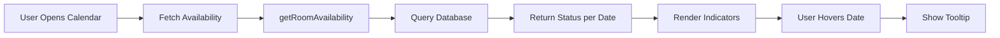

# 📅 Enhanced Booking Calendar - Complete Guide

## 🎯 What's Been Implemented

Successfully extended the booking calendar with **dynamic availability indicators** featuring:
- Real-time room availability fetching
- Color-coded status indicators (green/yellow/red)
- Interactive tooltips
- Loading states and error handling
- Zustand state management
- Full TypeScript support

---

## 🚀 Quick Start

### Demo Page (Recommended for Testing)

Navigate to: **`/calendar-demo-enhanced`**

Or add to your app:

```tsx
import EnhancedCalendarDemo from '@/components/Calendar/EnhancedCalendarDemo'

export default function Page() {
  return <EnhancedCalendarDemo />
}
```

### Using with Zustand Store

```tsx
'use client'

import { EnhancedBookingCalendar } from '@/components/Calendar'
import { useBookingStore } from '@/store/booking.store'

export default function BookingPage() {
  const { selectedRoomTypeId, dateRange, setDateRange } = useBookingStore()
  
  if (!selectedRoomTypeId) return <div>Select a room type first</div>
  
  return (
    <EnhancedBookingCalendar
      roomTypeId={selectedRoomTypeId}
      selectedRange={dateRange}
      onSelect={setDateRange}
    />
  )
}
```

### Standalone Component

```tsx
'use client'

import { useState } from 'react'
import { EnhancedBookingCalendar } from '@/components/Calendar'

export default function Page() {
  const [range, setRange] = useState({ from: new Date(), to: null })
  
  return (
    <EnhancedBookingCalendar
      roomTypeId="your-room-type-id"
      selectedRange={range}
      onSelect={setRange}
    />
  )
}
```

---

## 📊 Availability Indicators

| Dot Color | Status | Rooms Available |
|-----------|--------|-----------------|
| 🟢 Green  | High   | More than 5     |
| 🟡 Yellow | Low    | 1 to 5          |
| 🔴 Red    | None   | 0 (Fully booked)|

Hover over any date to see: **"X rooms available"**

---

## 🎨 Props Reference

### EnhancedBookingCalendar

```typescript
interface EnhancedBookingCalendarProps {
  // Required
  roomTypeId: string
  selectedRange: { from: Date; to: Date | null }
  onSelect: (range: { from: Date; to: Date | null }) => void
  
  // Optional
  minDate?: Date                    // Default: today
  maxDate?: Date
  numberOfMonths?: number           // Default: 2
  disabledDates?: Date[]
  onAvailabilityLoad?: (data: RoomAvailabilityByDate[]) => void
  onError?: (error: string) => void
}
```

---

## 🗄️ Zustand Store

### Accessing State

```tsx
import { useBookingStore } from '@/store/booking.store'

const {
  selectedRoomTypeId,
  dateRange,
  availabilityData,
  isLoadingAvailability,
  availabilityError,
  guestCount,
  roomCount,
} = useBookingStore()
```

### Actions

```tsx
const {
  setRoomType,
  setDateRange,
  setCheckIn,
  setCheckOut,
  setGuestCount,
  setRoomCount,
  resetBooking,
} = useBookingStore()
```

### Selectors

```tsx
import { 
  useIsDateRangeComplete,
  useNightCount,
  useIsBookingReady,
  useAvailabilityForDate,
} from '@/store/booking.store'

const isComplete = useIsDateRangeComplete()  // boolean
const nights = useNightCount()               // number
const isReady = useIsBookingReady()         // boolean
```

---

## 📱 Responsive Design

- **Desktop**: 2 months side-by-side
- **Tablet**: 2 months stacked
- **Mobile**: 1 month, optimized for touch

---

## 🔧 How It Works



### Data Flow

1. Component mounts or month changes
2. `fetchAvailability()` is called
3. Server action `getRoomAvailability()` queries `RoomInventory`
4. Returns array of `{ date, availableRooms, status }`
5. Component builds `availabilityMap` for O(1) lookups
6. Calendar renders with colored dots via modifiers
7. Tooltips show on hover

---

## 🎯 Common Patterns

### 1. Complete Booking Flow

```tsx
function BookingFlow() {
  const store = useBookingStore()
  
  return (
    <div className="space-y-6">
      <RoomTypeSelector 
        value={store.selectedRoomTypeId}
        onChange={store.setRoomType}
      />
      
      {store.selectedRoomTypeId && (
        <EnhancedBookingCalendar
          roomTypeId={store.selectedRoomTypeId}
          selectedRange={store.dateRange}
          onSelect={store.setDateRange}
        />
      )}
      
      <GuestCountInput
        value={store.guestCount}
        onChange={store.setGuestCount}
      />
      
      <BookButton disabled={!useIsBookingReady()} />
    </div>
  )
}
```

### 2. Price Calculation

```tsx
function BookingWithPrice() {
  const { dateRange, roomCount } = useBookingStore()
  const nights = useNightCount()
  const room = useRoom() // Your hook
  
  const total = nights * roomCount * (room.pricePerNight / 100)
  
  return (
    <>
      <EnhancedBookingCalendar {...props} />
      {total > 0 && (
        <div className="text-2xl font-bold">
          Total: ${total.toFixed(2)}
        </div>
      )}
    </>
  )
}
```

### 3. Analytics Tracking

```tsx
<EnhancedBookingCalendar
  {...props}
  onAvailabilityLoad={(data) => {
    analytics.track('availability_loaded', {
      roomTypeId: props.roomTypeId,
      dates: data.length,
      greenDays: data.filter(d => d.status === 'green').length,
    })
  }}
  onError={(error) => {
    analytics.track('availability_error', { error })
  }}
/>
```

---

## 🐛 Troubleshooting

### No room types available

```tsx
// First, ensure room types exist in database
import { prisma } from '@/lib/prisma'

const roomTypes = await prisma.roomType.findMany()
console.log(roomTypes) // Should show your room types
```

### No availability showing

```tsx
// Create inventory for testing
import { createBulkInventory } from '@/actions/rooms/room-inventory.action'

await createBulkInventory({
  roomTypeId: 'clx123456',
  startDate: new Date('2025-11-01'),
  endDate: new Date('2025-12-31'),
  availableRooms: 10,
})
```

### Tooltips cut off

Ensure parent elements allow overflow:

```css
.calendar-container {
  overflow: visible !important;
}
```

---

## 📦 File Structure

```
src/
├── components/Calendar/
│   ├── EnhancedBookingCalendar.tsx      # Main component
│   ├── EnhancedCalendarDemo.tsx         # Full demo
│   ├── EnhancedBookingCalendar.css      # Custom styles
│   ├── BookingCalendar.tsx              # Original component
│   └── index.ts                         # Exports
├── store/
│   └── booking.store.ts                 # Zustand store
└── app/calendar-demo-enhanced/
    └── page.tsx                         # Demo page
```

---

## ✅ Testing Checklist

Visit `/calendar-demo-enhanced` and verify:

- [x] Room type selection updates calendar
- [x] Month navigation fetches new data
- [x] Availability dots display correctly
- [x] Tooltips show on hover
- [x] Loading skeleton appears initially
- [x] Error banner shows with retry button
- [x] Date selection works
- [x] Mobile layout stacks properly
- [x] State persists after page reload

---

## 🚀 Next Steps

1. **Integrate into your booking flow**
2. **Connect to real room type data**
3. **Add payment processing**
4. **Implement confirmation emails**
5. **Add booking history**

---

## 💡 Pro Tips

- **Performance**: Availability is cached per month
- **Persistence**: State saved to localStorage automatically
- **Accessibility**: Fully keyboard navigable
- **Mobile**: 44px touch targets for easy tapping
- **Errors**: Auto-retry on failed loads

---

## 📚 Documentation

- [Implementation Summary](../../docs/CALENDAR_AVAILABILITY_IMPLEMENTATION.md)
- [Get Room Availability API](../../docs/GET_ROOM_AVAILABILITY.md)
- [Zustand Stores Guide](../../docs/ZUSTAND_STORES_STEP3.md)

---

**Questions?** Check `EnhancedCalendarDemo.tsx` for complete working examples!
